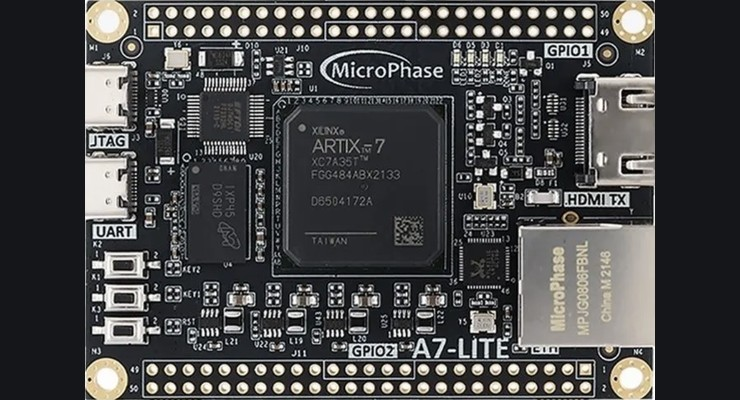
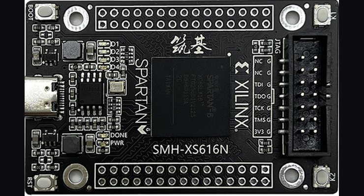
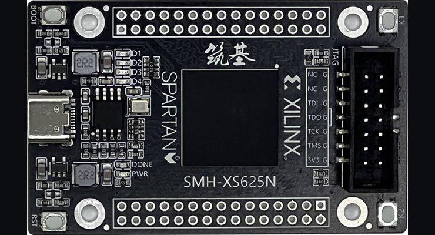
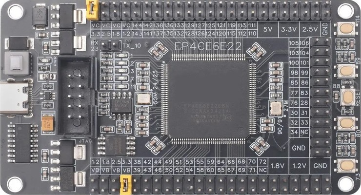
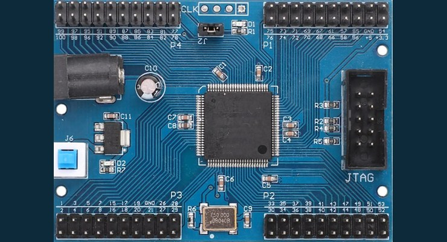

# Logisim-evolution board definitions for inexpensive FPGA boards

Board description files for [Logisim-evolution](https://github.com/logisim-evolution/logisim-evolution)'s
**FPGA Commander**. They let you map a circuit drawn in Logisim onto the LEDs, buttons and I/O
headers of cheap FPGA/CPLD boards from AliExpress, Amazon and eBay, then synthesize it and
download it to real hardware.

Each `.xml` file contains the FPGA part information, the on-board clock, the pin mapping of the
user LEDs, buttons and header pins, and an embedded photo of the board that is shown in the
FPGA Commander's mapping dialog. The photos in [`images/`](images) were extracted from these files.

## Boards

| File | Board | Vendor / family | FPGA chip | Package | Clock | LEDs | Buttons | Header I/O pins |
|------|-------|-----------------|-----------|---------|-------|------|---------|-----------------|
| [`A7-LITE.xml`](A7-LITE.xml) | [MicroPhase A7-Lite](https://fpga-docs.microphase.cn/en/latest/DEV_BOARD/A7-LITE/A7-Lite_Reference_Manual.html) | AMD/Xilinx Artix-7 | XC7A35T-2 | FGG484 | 50 MHz (J19) | 2 | 3 | 88 |
| [`XS616N.xml`](XS616N.xml) | [Simiao XS616N](http://doc.simiaohub.com/p/xs616n/) | AMD/Xilinx Spartan-6 | XC6SLX16-2 | FTG256 | 50 MHz (T7) | 4 | 3 | 52 |
| [`XS625N.xml`](XS625N.xml) | [Simiao XS625N](http://doc.simiaohub.com/p/xs625n/) | AMD/Xilinx Spartan-6 | XC6SLX25-2 | FTG256 | 50 MHz (T7) | 4 | 3 | 52 |
| [`EP4CE6E22_MiniBoard.xml`](EP4CE6E22_MiniBoard.xml) | Cyclone IV EP4CE6 mini board | Intel/Altera Cyclone IV E | EP4CE6E22C8N | EQFP144 | 50 MHz (PIN_24) | 5 | 4 | 70 |
| [`EPM240_MAXII.xml`](EPM240_MAXII.xml) | MAX II EPM240 CPLD minimum system board | Intel/Altera MAX II | EPM240T100C5N | TQFP100 | 50 MHz (PIN_12) | 1 | 0 | 76 |

All LEDs and buttons on these boards are active-low.

### MicroPhase A7-Lite (Artix-7)

A small Artix-7 board with DDR3, Gigabit Ethernet, HDMI out, USB-JTAG and USB-UART. It is sold with
XC7A35T, XC7A100T and XC7A200T chips; this definition is for the **XC7A35T** version. For the other
versions, change `Part` in `FPGAInformation`. The configuration flash is an IS25LP128F.

- [MicroPhase A7-Lite reference manual](https://fpga-docs.microphase.cn/en/latest/DEV_BOARD/A7-LITE/A7-Lite_Reference_Manual.html)
- [Product page (OpenSourceSDRLab)](https://opensourcesdrlab.com/products/fpga-development-board-core-board-xilinx-artix-7-xc7a35t-100t-a7-lite)
- Example projects: [LED blink](https://github.com/kisek/fpga_a7-lite_led), [HDMI output](https://github.com/kisek/fpga_a7-lite_hdmi)
- Ozon: [A7-Lite-35T](https://www.ozon.ru/product/demonstratsionnaya-plata-xilinx-artix-7-fpga-microphase-a7-lite-35t-i-bazovaya-plata-dlya-razrabotki-4820530355/), [A7-Lite XC7A35T](https://www.ozon.ru/product/plata-razrabotchika-fpga-xilinx-artix-7-xc7a35t-a7-lite-s-programmatorom-3114582763/), [A7-Lite-35T](https://www.ozon.ru/product/demonstratsionnaya-plata-microphase-a7-lite-35t-na-fpga-xilinx-artix-7-5560707625/)

Toolchain: AMD Vivado.

The third button is the board's reset key, which is not connected to a user FPGA pin (`RESET_UNMAPPED`).

### Simiao XS616N / XS625N (Spartan-6)

| XS616N | XS625N |
|--------|--------|
|  |  |

Nano-sized (68 × 42 mm) Spartan-6 boards from Simiao Electronics (思妙电子). Each has a 50 MHz
oscillator, 16 Mbit W25Q16 configuration flash, 4 user LEDs (D1–D4), user buttons K1, K2 and RST,
52 user I/O on two pin headers and Type-C power. The pin names are printed on the back of the board.
The XS616N uses an XC6SLX16 and the XS625N an XC6SLX25. Both use the FTG256 package and the same
pinout. You need a separate Xilinx JTAG programmer.

- XS616N: [documentation](http://doc.simiaohub.com/p/xs616n/), [schematic (PDF)](http://d.simiaohub.com/p/xs616n/xs616n_sch.pdf), [downloads](http://doc.simiaohub.com/p/xs616n/doc.html)
- XS625N: [documentation](http://doc.simiaohub.com/p/xs625n/), [schematic (PDF)](http://d.simiaohub.com/p/xs625n/xs625n_sch.pdf), [downloads](http://doc.simiaohub.com/p/xs625n/doc.html)
- [Simiao Electronics Taobao store](https://simiaohub.taobao.com/)
- Ozon (XS616N): [listing 1](https://www.ozon.ru/product/xs616n-modul-na-spartan6-xc6slx16-1749900028/), [listing 2](https://www.ozon.ru/product/plata-premium-xilinx-spartan6-xs616n-4918517539/), [listing 3](https://www.ozon.ru/product/kachestvennyy-plis-spartan6-xc6slx16-xs616n-ot-yantech-4918526800/). The XS625N is not sold on Ozon.

Toolchain: Xilinx ISE 14.7. Vivado does not support Spartan-6.

### Cyclone IV EP4CE6E22C8N mini board

A low-cost Cyclone IV board with 50 MHz and 27 MHz oscillators, a CH340 USB-UART, W25Q flash,
5 LEDs, 4 user buttons and a reset button. The UART is on PIN_10 (FPGA TX) and PIN_23 (FPGA RX).
The reset button (PIN_88) is left out of the definition on purpose.

- [Getting started with the EP4CE6E22C8N board (IoT Engineering Education, KMUTNB)](https://iot-kmutnb.github.io/blogs/fpga/fpga_ep4ce6_board/)
- [Amazon: EP4CE6E22C8N development board with CH340](https://www.amazon.com/HanOaki-EP4CE6E22C8N-Development-Dual-Crystal-Oscillators/dp/B0GF28QSMR)
- [FPGAkey: board introduction and pinout](https://www.fpgakey.com/technology/details/intel-altera-cyclone-iv-fpga-ep4ce6e22c8n-development-board-introduce-including-datasheet-and-pinout)
- Ozon: [listing 1](https://www.ozon.ru/product/plata-razrabotki-ep4ce6e22c8n-plata-yadra-fpga-sistemnaya-3577991369/), [listing 2](https://www.ozon.ru/product/1-sht-sistemnaya-plata-s-fpga-yadrom-altera-cycloneiv-ep4ce6e22c-8n-dlya-razrabotki-4647410863/), [listing 3](https://www.ozon.ru/product/programmiruemaya-plata-fpga-ep4ce6e22c8n-dlya-razrabotki-3117533606/)

Toolchain: Intel Quartus Prime Lite 20.1 or older. Newer releases no longer support Cyclone IV.

### MAX II EPM240 CPLD minimum system board

The classic blue/red EPM240T100C5N breakout with four 2×10 headers, a 50 MHz oscillator and a
JTAG port. Header pins are labelled with the chip pin number, which matches the silkscreen.

- [Amazon: MAX II EPM240 minimum system core board](https://www.amazon.com/Electronic-Components-EPM240T100C5N-Minimum-Development/dp/B08B855CNB)
- [diymore: MAX II EPM240 CPLD development board](https://www.diymore.cc/products/max-ii-epm240-cpld-development-board-experiment-board-learning-breadboard-module)
- [Aideepen: 5V MAX II EPM240 core board](https://www.aideepen.com/products/5v-max-ii-epm240-cpld-minimum-system-core-board-development-board-module)
- Ozon: [board](https://www.ozon.ru/product/dlya-altera-max-ii-epm240-cpld-development-board-obuchayushchaya-plata-testovaya-panel-1797373863/), [board](https://www.ozon.ru/product/panel-obucheniya-i-testirovaniya-dlya-platy-razrabotki-altera-max-ii-epm240-cpld-4669988739/), [kit with USB Blaster](https://www.ozon.ru/product/plata-obucheniya-razrabotke-cpld-max-ii-epm240-usb-kabel-1764796853/). Choose the blue board; the red EPM240 boards on Ozon have a different layout.

Toolchain: Intel Quartus Prime Lite.

The board has no user buttons. The blue switch J6 next to the power jack is the power switch and
is not connected to the CPLD.

## Usage

1. Install [Logisim-evolution](https://github.com/logisim-evolution/logisim-evolution/releases)
   and the vendor toolchain for your board (Vivado, ISE or Quartus).
2. Open your circuit and select **FPGA → Synthesize & Download** to open the FPGA Commander.
3. In the board selection, pick **Other** and load the board's `.xml` file from this repository.
4. Set the toolchain paths under **Settings**, map your circuit's inputs and outputs to the
   components on the board picture, then run **Execute**.

## Contributing

Corrections and new boards are welcome. If you find a wrong pin, please open an issue or a pull
request and mention where the correct pinout comes from (a schematic, the vendor manual or a test
on real hardware).

## License

[MIT](LICENSE)
